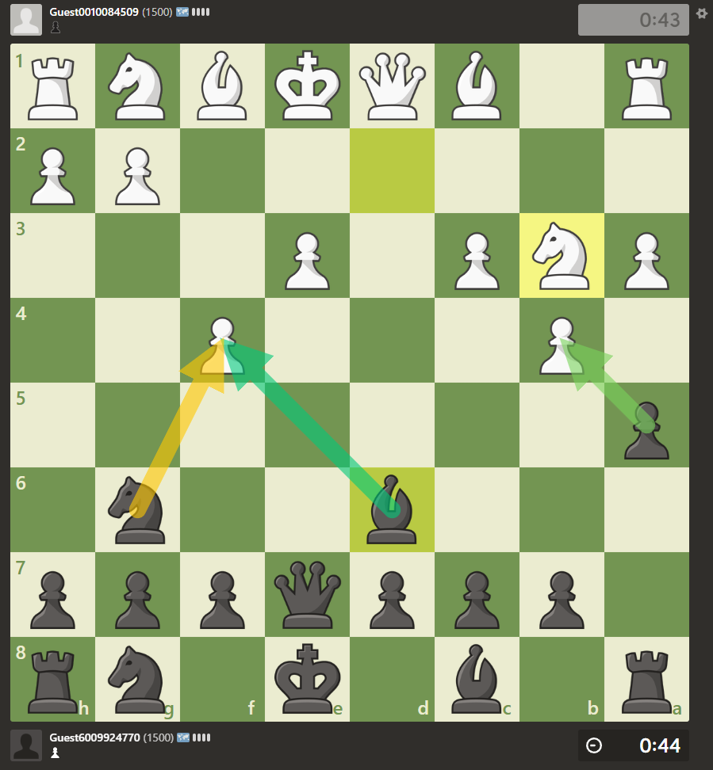
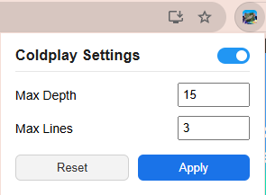
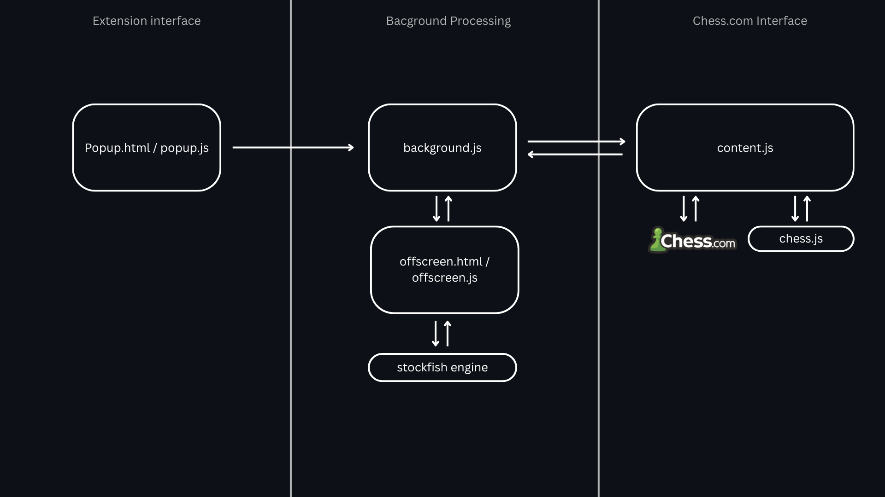

# Disclaimer

This extension was created for educational purposes as a proof of concept. It is not intended for use in live games against other players. Please use it responsibly and avoid using it in any live Chess.com matches.

# Coldplay (Chess.com Stockfish Overlay Extension)

Coldplay is a Chrome extension that uses Stockfish and chess.js to analyze Chess.com live games and display the engine's recommended moves as an overlay on the chessboard.

The extension includes a popup menu where you can configure:
- Search Depth - The analysis depth used by Stockfish
- MultiPV - The number of top engine move to be displayed

# Installation

To install the extension, 
1. Open `chrome://extensions/` in Google Chrome.
2. Enable Developer mode (if it is not already enabled).
3. Click **Load unpacked**.
4. Select the extension folder.

# Architecture

## popup.html / popup.js

These files provide the extension's user interface. Users can configure settings such as the Stockfish search depth and MultiPV.

When a setting is changed:
- The new value is saved to `chrome.storage.local`
- A message is sent to `background.js` via `chrome.runtime` so the rest of the extension can react to the change. 

## background.js

`background.js` acts as the central coordinator for the extension. It relays messages between `popup.js`, `content.js`, and `offscreen.js`, and is responsible for creating and managing the offscreen document used for engine analysis.

## content.js

`content.js` is injected into Chess.com pages.

Its responsibilities includes:
- Detecting new moves via the move history container
- Reconstructing the current board position using chess.js and the move history
- Sending the current position in FEN (Forsyth-Edwards Notation) to `background.js` for analysis
- Receiving the engine's best moves
- Updating the page by rendering SVG arrow overlays on the chessboard to indicate the recommended moves

## offscreen.js

`offscreen.js` runs inside an offscreen document created by `background.js`. It hosts the Stockfish engine and performs position analysis without blocking the main extension components.

After completing an analysis, it sends the engine results back through `background.js`, which forwards them to `content.js` for display.